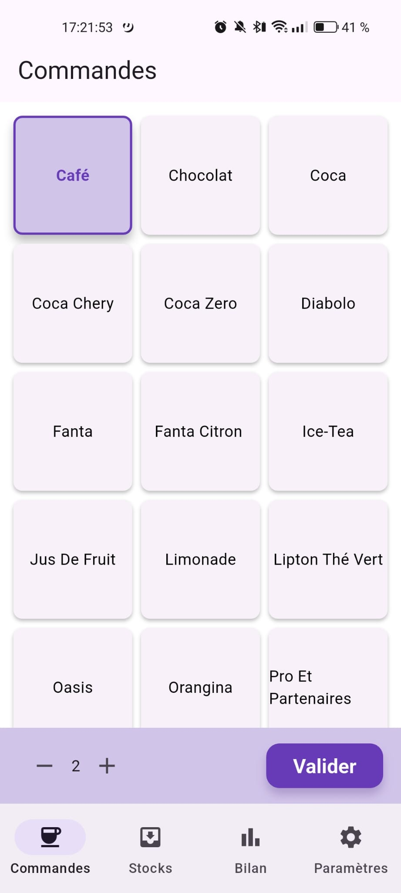
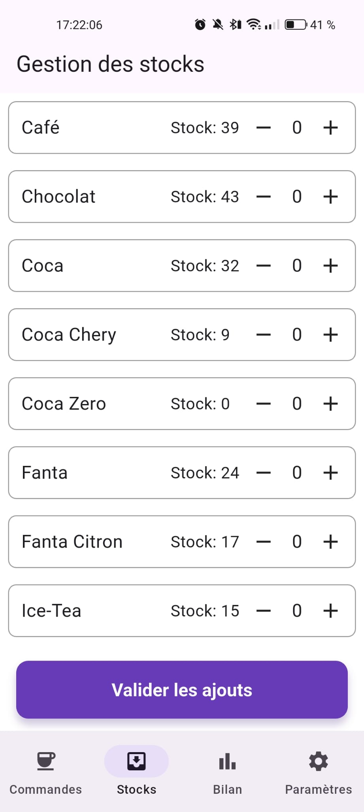
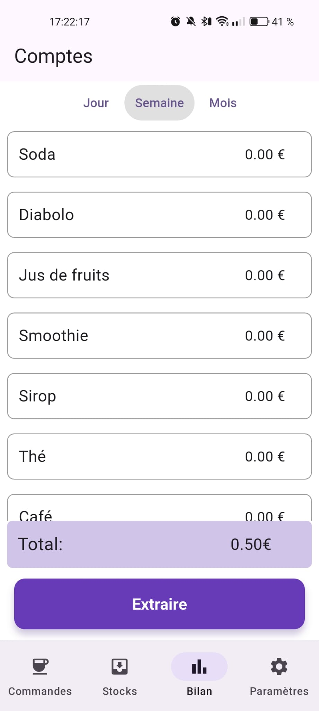
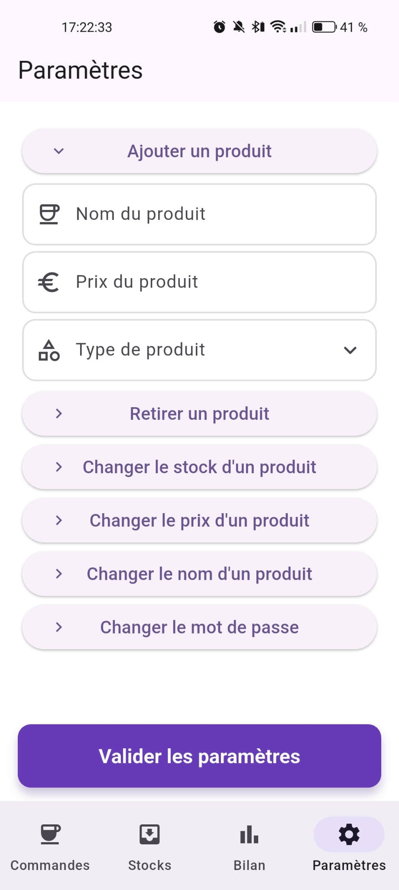

# Tout'az Café

<p align="center">

</p>

Bienvenue sur le dépôt du projet **Tout'az Café**. Ce projet est une application mobile de gestion de café, développée avec **Flutter**. Elle permet de gérer les commandes, les stocks et de suivre les ventes en temps réel.

## 📋 Table des Matières

- [Description](#description)
- [Fonctionnalités](#fonctionnalités)
- [Aperçu](#aperçu)
- [Stack Technique](#stack-technique)
- [Installation](#installation)
- [Licence](#licence)
- [Contact](#contact)

## Description

**Tout'az Café** est une solution complète pour la gestion quotidienne d'un café. L'application facilite la prise de commande, le suivi des stocks et l'analyse des ventes, offrant une interface intuitive pour le personnel.

## Fonctionnalités

Ce projet vise à offrir une expérience fluide pour la gestion du café. Voici les fonctionnalités principales :

- **Commandes (Achats)** : Interface de prise de commande rapide et intuitive.
- **Gestion des Stocks** : Suivi en temps réel des inventaires.
- **Bilan (Ventes)** : Visualisation des ventes et export des données (Excel).
- **Paramètres** : Configuration de l'application sécurisée par mot de passe.
- **Authentification** : Connexion anonyme sécurisée via Firebase.

## Aperçu

| Commandes | Stocks | Bilan | Paramètres |
|:---:|:---:|:---:|:---:|
|  |  |  |  |

## Stack Technique

Ce projet utilise des technologies modernes pour assurer performance et maintenabilité :

- **Frontend** : [Flutter](https://flutter.dev/) (Dart)
- **Backend / BaaS** : [Firebase](https://firebase.google.com/)
  - **Authentication** : Connexion anonyme.
  - **Firestore** : Base de données NoSQL temps réel pour les données.
- **State Management** : [Provider](https://pub.dev/packages/provider) (via `settingsController` etc.)
- **Autres dépendances clés** :
  - `excel` : Export des données.
  - `share_plus` : Partage de fichiers.
  - `intl` : Internationalisation et formatage.

## Architecture du Projet

La structure du code source dans `lib/` est organisée comme suit :

```
lib/
├── main.dart           # Point d'entrée de l'application
├── ui/                 # Interface utilisateur (Pages et Navigation)
│   ├── navigation/     # Logique de navigation principale
│   ├── purchasePage.dart
│   ├── stockPage.dart
│   ├── salesPage.dart
│   └── settingsPage.dart
├── controllers/        # Gestion de l'état et logique UI
├── services/           # Logique métier et appels API
└── Models/             # Modèles de données
```

## Installation

Suivez ces étapes pour lancer le projet localement.

### Prérequis

- [Flutter SDK](https://docs.flutter.dev/get-started/install) installé.
- Un projet Firebase configuré.

### Étapes

1. **Cloner le dépôt**
   ```bash
   git clone https://github.com/Taeldev/toutaz_cafe.git
   cd toutaz_cafe
   ```

2. **Installer les dépendances**
   ```bash
   flutter pub get
   ```

3. **Configuration**
   - Ajoutez le fichier `.env` à la racine du projet si nécessaire.
   - Configurez Firebase pour votre plateforme (Android/iOS/Web).

4. **Lancer l'application**
   ```bash
   flutter run
   ```

## Licence

Ce projet est distribué sous la licence [GPL-3.0](LICENSE). Voir le fichier [LICENSE](LICENSE) pour plus d'informations.
© 2025 Taël Baucher. Tous droits réservés.

## Contact

**Taël Baucher** - [Profil GitHub](https://github.com/TaelBaucher)
